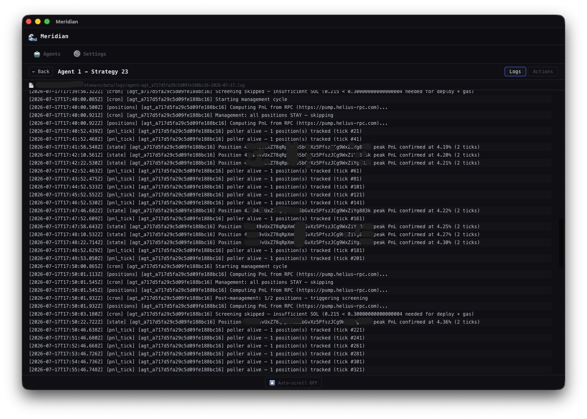

# Etemaro

**Autonomous Meteora DLMM liquidity management agent for Solana, powered by LLMs.**

Etemaro runs continuous screening and management cycles, deploying capital into high-quality Meteora DLMM pools and closing positions based on live PnL, yield, and range data.

*Note: This project was fork-renamed from Meridian due to a complete architecture redesign, scalability improvements, and lack of active support in the main repository. Etemaro remains fully compatible with shared Meridian agents, using the same public key to share collective lessons.*

---

## 📚 Documentation

Detailed guides are available in the [docs/](docs) directory:

- **[Start Here (Index)](docs/START_HERE.md)** — List of all documents.
- **[Architecture Guide](docs/ARCHITECTURE.md)** — Core TypeScript hexagonal design, ReAct loop, and tools.
- **[Configuration Reference](docs/CONFIGURATION.md)** — Precedence, settings, and the full `user-config.json` [field reference](docs/CONFIGURATION.md#2-user-configuration-user-configjson).
- **[Usage Guide](docs/USAGE_GUIDE.md)** — Step-by-step instructions, REPL commands, and flowcharts.
- **[HiveMind Shared Lessons](docs/HIVEMIND.md)** — Collective-learning sync (shared-lesson pull/push).
- **[Q&A / FAQ](docs/QA.md)** — Frequently asked questions.

---

## 🚀 Quick Start

### 1. Install Dependencies

```bash
git clone https://github.com/romankurnovskii/etemaro
cd etemaro
npm install
```

### 2. Configure Environment

Run the interactive setup wizard:

```bash
npm run setup
```

This will configure your `.env` (API keys, private keys) and `config/user-config.json` (risk profile, thresholds).

### 3. Run

**Option A: Direct (development / dry-run)**

```bash
npm run dev      # Dry-run mode (safe simulation, no real transactions)
npm start        # Live autonomous agent mode
```

**Option B: PM2 (production process manager)**

```bash
npm run build
npm run pm2:start    # Start daemon under PM2 with auto-restart
npm run pm2:logs     # Tail live logs
```

**Option C: Docker**

```bash
# Development (hot reload, mounts source)
docker compose -f docker-compose.dev.yml up --build

# Production (on remote server, .env already present)
docker compose -f docker-compose.prod.yml up -d --build --force-recreate --remove-orphans
```

---

## 🖥️ Desktop App



The **DesktopApp** is a cross-platform, free desktop application currently in active development — with a planned release on **September 1st**.

### Key Features

- **Multiple Agents** — Run and manage several autonomous agents simultaneously.
- **Remote & Local Agents** — Deploy agents locally or connect to remote instances.
- **Free AI Credits** — Built-in free credits for AI-powered analysis and decision-making.
- **Cross-Platform & Free** — Available on Windows, macOS, and Linux at no cost.
- **AI Auto-Generated Strategies** — Automatically generate trading strategies using AI-driven backtesting.
- **Neuro-Bayesian Monte Carlo API** — Access probability calculations before opening positions, powered by the [Neuro-Bayesian Monte Carlo method](https://romankurnovskii.com/en/research/neuro-bayesian-architecture-in-economic-modeling/).
