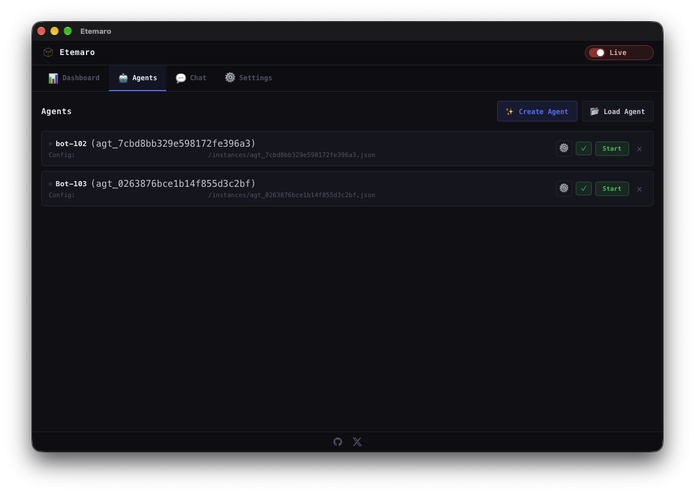

<p align="center">
  
</p>

# Etemaro

An LLM-powered agent that autonomously manages liquidity positions on Meteora DLMM for Solana.



Etemaro runs continuous screening and management cycles, deploying capital into high-quality Meteora DLMM pools and closing positions based on live PnL, yield, and range data — all driven by an LLM reasoning over real on-chain state instead of following a fixed rule set.

## Features

- **LLM-driven ReAct loop** — The agent inspects live pool and position data, reasons about risk and yield, then calls tools to deploy, manage, or close positions.
- **HiveMind collective learning** — Agents share lessons and performance events across a fleet, so every instance benefits from what others have learned.
- **Dry-run safe simulation** — Test strategies against real on-chain data without spending gas; mock positions are tracked locally.
- **Multi-surface interface** — CLI for one-shot commands, a Telegram bot for remote control, and a cross-platform desktop app.
- **Strategy library + signal adaptation** — Preset LP strategies with configurable bin distribution; signal weights evolve based on closed-position performance.

---

## Prerequisites & Credentials

Before running Etemaro, ensure you have:

- **Node.js**: `>= 22.0.0`
- **Required Credentials**:
  - `WALLET_PRIVATE_KEY` — Solana wallet base58 private key (for deploying/closing positions)
  - `LLM_API_KEY` — API key for OpenAI, OpenRouter, or an OpenAI-compatible provider
  - `JUPITER_API_KEY` — Jupiter swap API key ([get one here](https://developers.jup.ag/portal/))

---

## Getting Started

> 💡 **Have questions?** Most common user questions, setup troubleshooting, multi-instance deployment steps, and PnL metric definitions are covered in **[docs/QA.md](docs/QA.md)**.

### ⚡ 1-Line Quick Install (CLI)

```bash
# Install Etemaro CLI globally (macOS / Linux)
curl -fsSL https://etemaro.com/install.sh | sh
```

_Or install via npm / Homebrew:_

```bash
npm install -g @etemaro/cli
# or: brew install romankurnovskii/awesome-brew/etemaro
```

### 🚀 30-Second Quickstart

```bash
# 1. Provide your Solana wallet private key (in a .env file or export)
export WALLET_PRIVATE_KEY="your_base58_solana_private_key"

# 2. Check live wallet balances
etemaro balance

# 3. Simulate and test strategies (dry-run mode, no real transactions)
etemaro start --dry-run

# 4. Start autonomous agent in live trading mode
etemaro start
```

---

### Desktop App (GUI)

- **macOS (via Homebrew)**:
  ```bash
  brew tap romankurnovskii/awesome-brew
  brew trust --cask romankurnovskii/awesome-brew/etemaro
  brew install romankurnovskii/awesome-brew/etemaro --cask
  ```
- **Windows / Linux / macOS (Direct Download)**:
  Download the latest installer or bundle from [GitHub Releases](https://github.com/romankurnovskii/etemaro/releases).

---

### Developer / Source Setup

```bash
# 1. Clone repo & install dependencies
git clone https://github.com/romankurnovskii/etemaro
cd etemaro
pnpm install

# 2. Copy config templates (.env and user-config.json)
cp .env.example .env
cp config/templates/user-config.example.json config/user-config.json

# 3. Start in dry-run mode
pnpm run dev
```

---

## Server Deployment

**Option A: PM2 (Production Process Manager)**

```bash
npm run build
npm run pm2:start    # Start daemon under PM2 with auto-restart
npm run pm2:logs     # Tail live logs
```

**Option B: Docker**

```bash
# Development (hot reload, mounts source)
docker compose -f docker-compose.dev.yml up --build

# Production (on remote server, .env already present)
docker compose -f docker-compose.prod.yml up -d --build --force-recreate --remove-orphans
```

---

## Documentation & Guides

- ❓ **[Q&A / FAQ Guide](docs/QA.md)** — Frequently asked questions covering setup, multi-instance deployment, dry runs, smart wallets, and PnL metrics (most user questions are covered here).
- 🚀 **[Getting Started Guide](docs/GETTING_STARTED.md)** — Step-by-step first-time setup, environment variables, strategy selection.
- 📖 **[Usage Guide](docs/USAGE_GUIDE.md)** — Daily operations, CLI commands, Telegram bot controls, REPL, and decision flows.
- 🏗️ **[Architecture Guide](docs/ARCHITECTURE.md)** — System layout, domain boundaries, adapter layer, and state management.
- ⚙️ **[Configuration Reference](docs/CONFIGURATION.md)** — Exhaustive configuration reference for `user-config.json`.
- 🧠 **[HiveMind Guide](docs/HIVEMIND.md)** — Fleet learning, lesson sharing, and shared presets.
- 💻 **[Desktop App](apps/desktop)** — Tauri-based cross-platform desktop UI.
