# Meridian — Full Application Flow

> **Meridian** is an autonomous Meteora DLMM liquidity management agent for Solana, powered by LLMs. It runs continuous screening and management cycles, deploying capital into high-quality Meteora DLMM pools and closing positions based on live PnL, yield, and range data.
>
> This is the **canonical flow reference** (architecture, startup, screening/management flows, learning, integrations). For day-to-day operation and commands, see [USAGE_GUIDE.md](USAGE_GUIDE.md). For config fields see [CONFIGURATION.md](CONFIGURATION.md); for HiveMind shared learning see [HIVEMIND.md](HIVEMIND.md).

---

## Table of Contents

1. [System Overview](#1-system-overview)
2. [Architecture](#2-architecture)
3. [Startup & Initialization](#3-startup--initialization)
4. [Configuration System](#4-configuration-system)
5. [The Agent Loop (ReAct)](#5-the-agent-loop-react)
6. [Screening Flow](#6-screening-flow)
7. [Management Flow](#7-management-flow)
8. [State Management](#8-state-management)
9. [Learning & Evolution](#9-learning--evolution)
10. [External Integrations](#10-external-integrations)
11. [User Interfaces](#11-user-interfaces)

---

## 1. System Overview

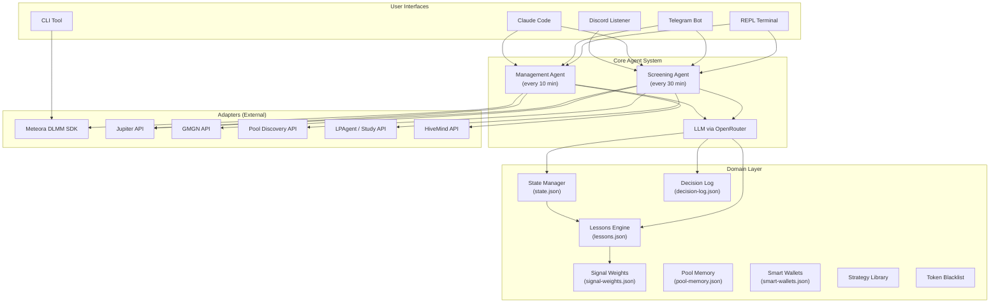

---

## 2. Architecture

The codebase follows a **Hexagonal Architecture** (Ports & Adapters) pattern:

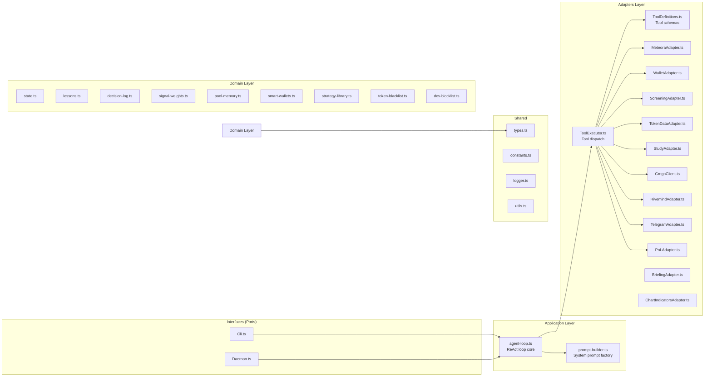

> **Path note:** `Cli.ts` lives at `packages/cli/src/Cli.ts`, `Daemon.ts` at `packages/daemon/src/Daemon.ts`, and every other `*.ts` shown above at `packages/core/src/...` (e.g. `agent-loop.ts` → `packages/core/src/application/agent-loop.ts`).

### Key Files

| File                                              | Role                                                            |
| ------------------------------------------------- | --------------------------------------------------------------- |
| `packages/core/src/config/Config.ts`              | Zod-validated config singleton from `user-config.json` + `.env` |
| `packages/core/src/application/agent-loop.ts`     | Core ReAct loop: LLM → tool call → repeat                       |
| `packages/core/src/application/prompt-builder.ts` | Builds role-specific system prompts                             |
| `packages/core/src/adapters/ToolExecutor.ts`      | Dispatches tool calls to adapter implementations                |
| `packages/core/src/adapters/ToolDefinitions.ts`   | OpenAI-format tool schemas                                      |
| `packages/core/src/domain/state.ts`               | Position registry in `state.json`                               |
| `packages/core/src/domain/lessons.ts`             | Learning engine + threshold evolution                           |
| `packages/core/src/domain/decision-log.ts`        | Structured decision rationale log                               |
| `packages/core/src/domain/signal-weights.ts`      | Darwinian signal weighting system                               |
| `packages/core/src/domain/pool-memory.ts`         | Per-pool deploy history + snapshots                             |

---

## 3. Startup & Initialization

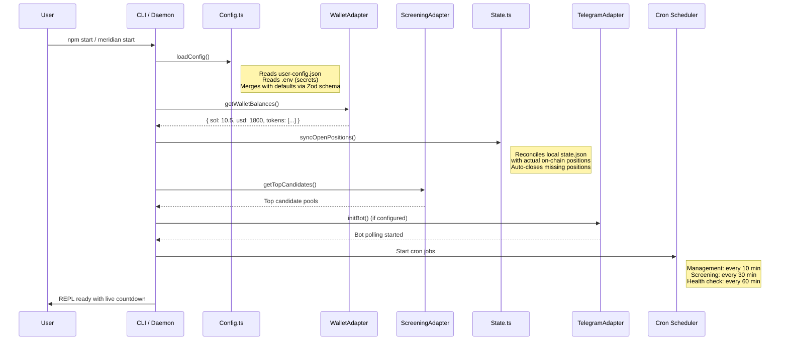

### Startup Checklist

1. **Config Load**: `user-config.json` + `.env` → Zod-validated `AppConfig` singleton
2. **Wallet Balance**: Fetch SOL + token balances from Solana RPC
3. **State Sync**: Reconcile `state.json` with on-chain positions (auto-close orphans)
4. **Telegram Bot**: Initialize polling (if `TELEGRAM_BOT_TOKEN` set)
5. **Cron Schedules**: Start management and screening cycles
6. **REPL Ready**: Interactive prompt with countdown to next cycle

---

## 4. Configuration System

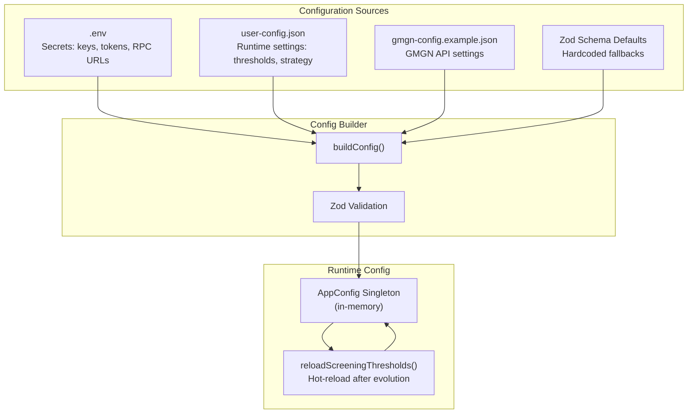

### Config Sections

| Section      | Purpose                                                               |
| ------------ | --------------------------------------------------------------------- |
| `risk`       | Max positions, max deploy amount                                      |
| `screening`  | Fee/TVL ratio, organic score, holder count, mcap, bin step thresholds |
| `management` | Deploy amount, stop loss, take profit, trailing TP, OOR wait time     |
| `strategy`   | LP strategy (bid_ask/spot), bin range                                 |
| `schedule`   | Management and screening interval (minutes)                           |
| `llm`        | Temperature, max tokens/steps, per-role model selection               |
| `darwin`     | Signal weight evolution settings                                      |
| `hiveMind`   | Shared learning sync settings                                         |
| `jupiter`    | Swap referral settings                                                |
| `indicators` | RSI/supertrend entry/exit indicators                                  |

---

## 5. The Agent Loop (ReAct)

The core of Meridian is a **ReAct (Reason + Act) loop** — the LLM reasons over live data, calls tools, observes results, and repeats until it produces a final answer.

```mermaid
sequenceDiagram
    participant Caller as Cron / REPL / Telegram
    participant Loop as agentLoop()
    participant Prompt as PromptBuilder
    participant LLM as OpenAI (OpenRouter)
    participant Tools as ToolExecutor
    participant Adapters as Adapters

    Caller->>Loop: goal + agentType
    Loop->>Prompt: buildSystemPrompt()
    Note right of Prompt: Injects: portfolio, positions,<br/>state summary, lessons,<br/>performance, decisions, weights

    Loop->>Loop: Build messages array

    loop ReAct Steps (max 20)
        Loop->>LLM: chat.completions.create()
        Note right of LLM: System prompt + history<br/>+ goal + tool definitions

        alt No tool calls → Final Answer
            LLM-->>Loop: content (final response)
            Loop-->>Caller: { content, userMessage }
        else Tool calls
            LLM-->>Loop: tool_calls[]

            loop For each tool call
                Loop->>Tools: executeTool(name, args)
                Tools->>Adapters: dispatch(name, args)
                Adapters-->>Tools: result
                Tools-->>Loop: { role: "tool", content: JSON }
            end

            Loop->>Loop: Append tool results to messages
            Note right of Loop: Continue loop
        end
    end
```

### Safety Mechanisms

| Mechanism                     | Purpose                                                                        |
| ----------------------------- | ------------------------------------------------------------------------------ |
| **Once-per-session lock**     | `deploy_position`, `close_position`, `swap_token` can only fire once per cycle |
| **No-retry lock**             | `deploy_position` locked after first attempt regardless of outcome             |
| **JSON repair**               | Malformed tool arguments auto-repaired via `jsonrepair`                        |
| **Provider fallback**         | Falls back to `stepfun/step-3.5-flash:free` on provider errors                 |
| **System role fallback**      | Embeds system prompt in user message if provider rejects `role: system`        |
| **Tool choice fallback**      | Retries without `tool_choice: required` if provider rejects it                 |
| **Rate limit handling**       | 30s wait on 429 errors                                                         |
| **Tool-required enforcement** | For action intents, rejects answers without tool calls (up to 2 retries)       |

### Role-Based Tool Access

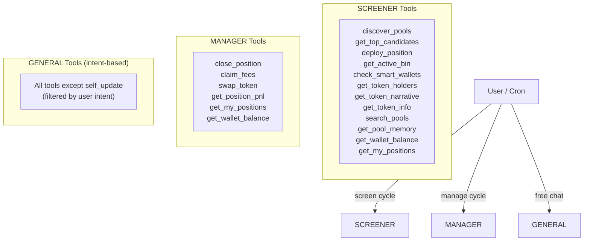

### Intent Detection (GENERAL role)

The GENERAL agent uses regex patterns to detect user intent and only expose relevant tools:

```
"why did you deploy?" → get_recent_decisions
"deploy into SOL/BONK" → deploy_position, get_top_candidates, ...
"close position X" → close_position, get_my_positions, ...
"what's my balance?" → get_wallet_balance, get_my_positions
"study top LPers" → study_top_lpers, get_pool_detail, ...
```

---

## 6. Screening Flow

The Screening Agent runs every 30 minutes (configurable) to find and deploy into the best Meteora DLMM pool.

```mermaid
flowchart TD
    START["Screening Cycle Triggered"]

    START --> CHECK_DISCORD{"Discord signals<br/>enabled?"}
    CHECK_DISCORD -->|Yes| LOAD_SIGNALS["Load pending Discord signals<br/>(discord-signals.json)"]
    CHECK_DISCORD -->|No| FETCH_CANDIDATES

    LOAD_SIGNALS --> FETCH_CANDIDATES

    FETCH_CANDIDATES["get_top_candidates()"]
    Note1["Pool Discovery API →<br/>Filter by: fee/TVL, organic,<br/>holders, mcap, bin step"]
    FETCH_CANDIDATES --> Note1
    Note1 --> SCORE["Score pools (0-100)<br/>+ signal weights boost"]
    SCORE --> RETURN_TOP["Return top N candidates"]

    RETURN_TOP --> LLM_SCREEN["LLM Screening Cycle"]
    Note2["System prompt includes:<br/>- Current portfolio<br/>- Open positions<br/>- Lessons learned<br/>- Signal weights<br/>- Recent decisions"]
    LLM_SCREEN --> Note2

    Note2 --> EVAL["LLM evaluates each candidate"]
    EVAL --> |"Has Discord signal?"| PRIORITY["Process Discord signal first"]
    EVAL --> |"No signal"| STANDARD["Standard evaluation"]

    PRIORITY --> DEEP_RESEARCH["Deep Research"]
    STANDARD --> DEEP_RESEARCH

    DEEP_RESEARCH["Token Research"]
    Note3["Tools used:<br/>- get_token_info (Jupiter audit)<br/>- get_token_holders (concentration)<br/>- get_token_narrative (story)<br/>- check_smart_wallets (alpha)<br/>- get_pool_memory (history)<br/>- study_top_lpers (LP patterns)"]
    DEEP_RESEARCH --> Note3

    Note3 --> DECIDE["LLM Decision"]
    DECIDE --> |"Deploy"| CHECK_SAFETY
    DECIDE --> |"Skip all"| SKIP_LOG["Log skip decision"]

    CHECK_SAFETY["Safety Checks"]
    Note4["- Blacklist check<br/>- Dev blocklist check<br/>- Cooldown check<br/>- Max positions check<br/>- Min SOL reserve check"]
    CHECK_SAFETY --> Note4

    Note4 --> DEPLOY["deploy_position()"]
    DEPLOY --> ON_CHAIN["On-chain transaction<br/>(Meteora DLMM SDK)"]
    ON_CHAIN --> TRACK["trackPosition()<br/>(state.json)"]
    TRACK --> DECISION_LOG["Log decision<br/>(decision-log.json)"]
    DECISION_LOG --> NOTIFY["Telegram notification"]

    SKIP_LOG --> DECISION_LOG
```

### Pool Scoring Pipeline

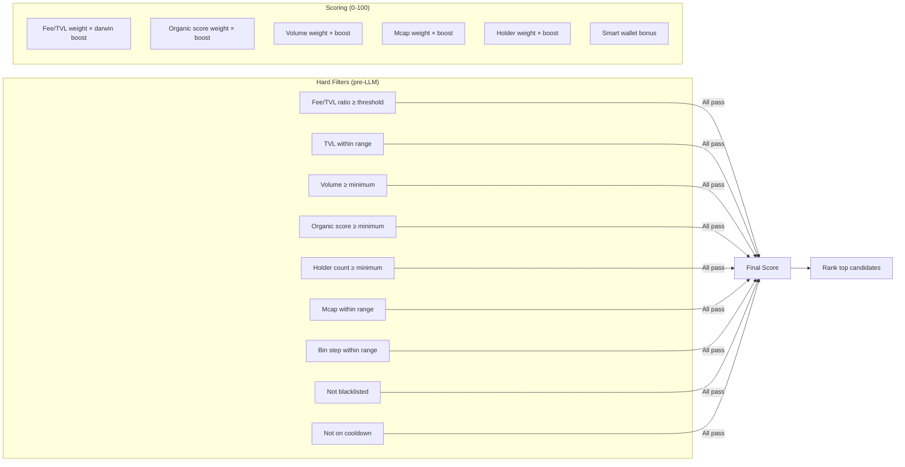

---

## 7. Management Flow

The Management Agent runs every 10 minutes (configurable) to evaluate each open position and act.

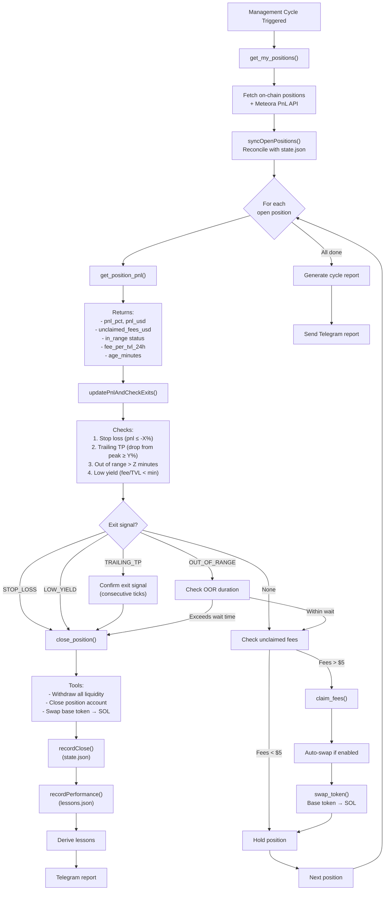

### Exit Conditions Detail

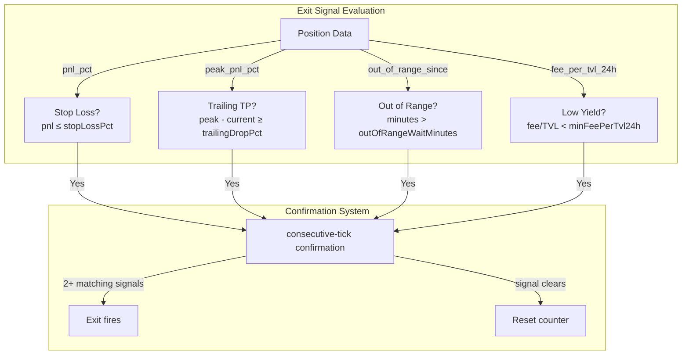

### Trailing Take Profit Flow

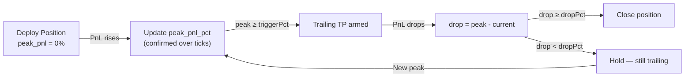

---

## 8. State Management

### Position Lifecycle

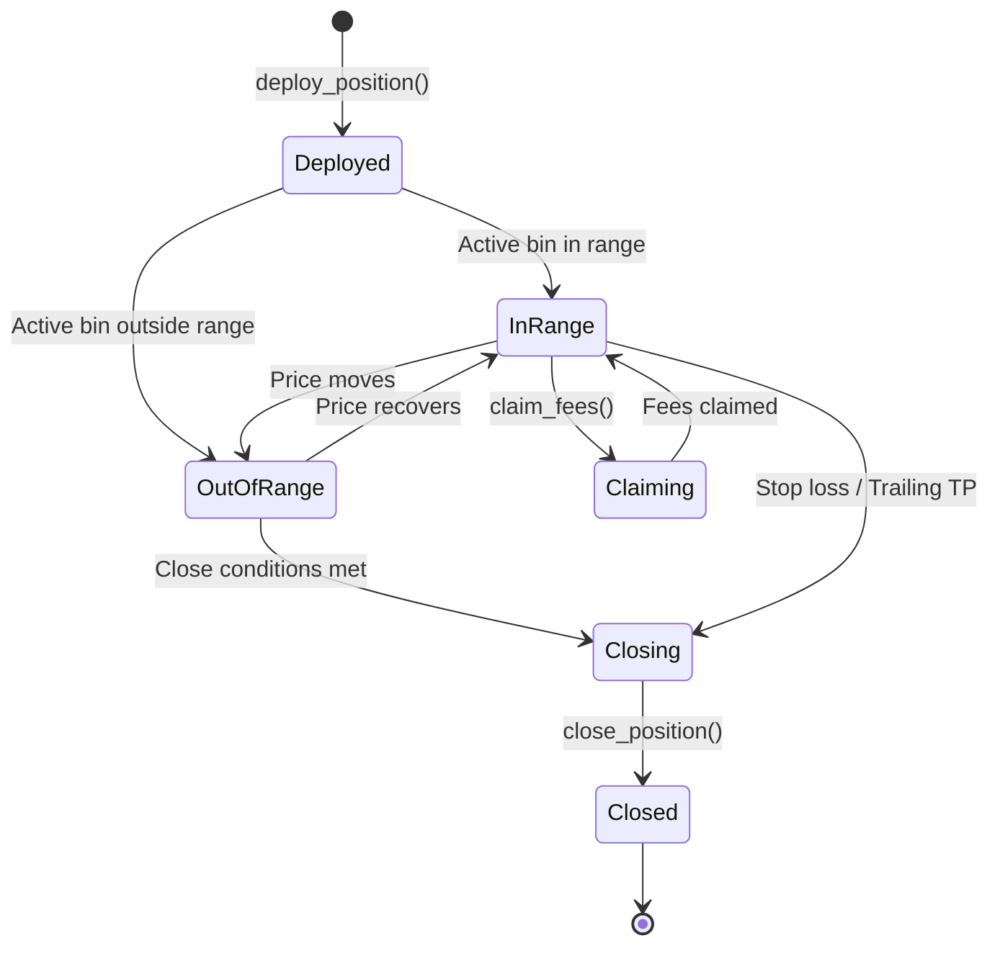

### Data Files

| File                      | Content                                                   | Updated By                                                              |
| ------------------------- | --------------------------------------------------------- | ----------------------------------------------------------------------- |
| `state.json`              | Position registry, OOR tracking, peak PnL, trailing state | `trackPosition()`, `recordClose()`, `markOutOfRange()`, `confirmPeak()` |
| `lessons.json`            | Derived lessons + raw performance records                 | `recordPerformance()`, `addLesson()`                                    |
| `decision-log.json`       | Structured deploy/close/skip rationale                    | `logDecision()`                                                         |
| `signal-weights.json`     | Darwinian signal weights                                  | `recalculateWeights()`                                                  |
| `pool-memory.json`        | Per-pool deploy history + notes                           | `recordPoolDeploy()`, `addPoolNote()`                                   |
| `smart-wallets.json`      | Tracked KOL/alpha wallets                                 | `addSmartWallet()`                                                      |
| `strategy-library.json`   | Saved LP strategies                                       | `addStrategy()`                                                         |
| `token-blacklist.json`    | Blacklisted token mints                                   | `addToBlacklist()`                                                      |
| `deployer-blacklist.json` | Blocked deployer wallets                                  | `blockDev()`                                                            |

---

## 9. Learning & Evolution

### Lesson Pipeline

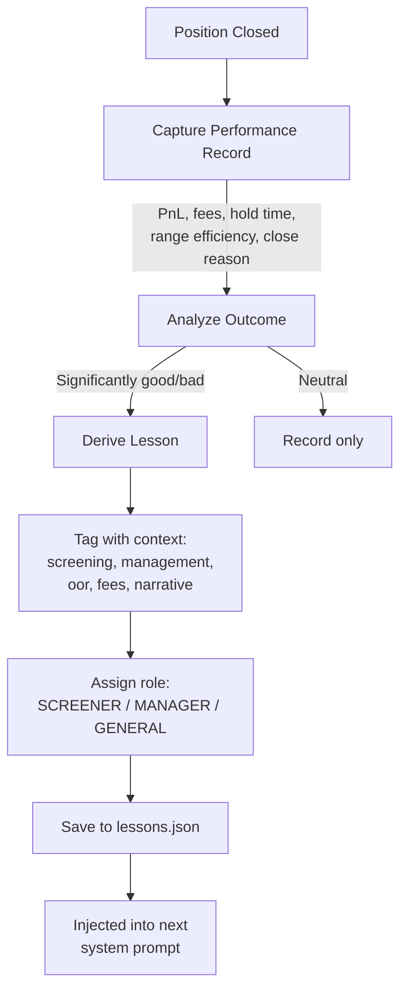

### Signal Weight Evolution (Darwin)

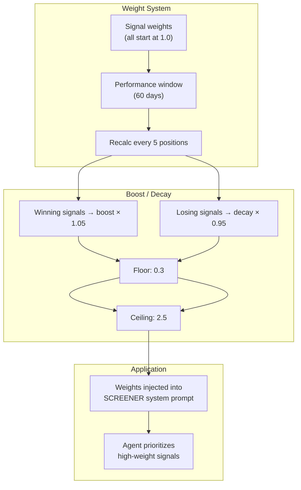

### Threshold Evolution

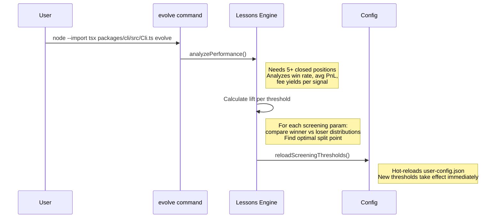

---

## 10. External Integrations

### Data Flow Diagram

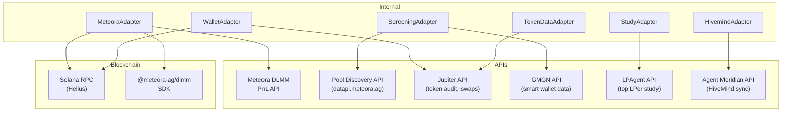

### Discord Signal Pipeline

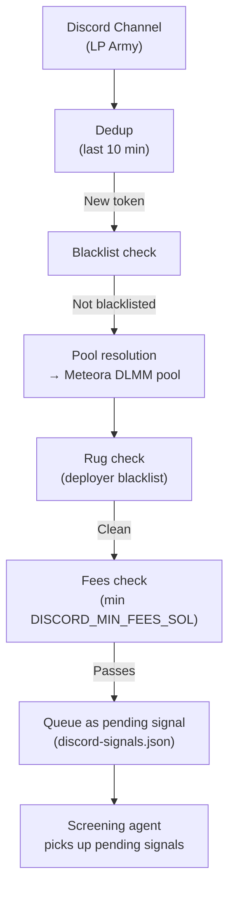

---

## 11. User Interfaces

### Interface Comparison

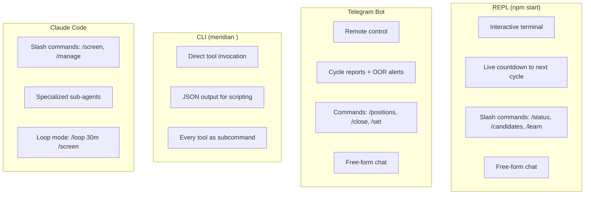

### Tool Categories

| Category                | Tools                                                                     | Used By |
| ----------------------- | ------------------------------------------------------------------------- | ------- |
| **Pool Discovery**      | `discover_pools`, `get_top_candidates`, `search_pools`, `get_pool_detail` | Screen  |
| **Token Research**      | `get_token_info`, `get_token_holders`, `get_token_narrative`              | Screen  |
| **Position Deploy**     | `get_active_bin`, `deploy_position`                                       | Screen  |
| **Position Management** | `get_my_positions`, `get_position_pnl`, `claim_fees`, `close_position`    | Manager |
| **Wallet**              | `get_wallet_balance`, `swap_token`                                        | Both    |
| **Learning**            | `add_lesson`, `list_lessons`, `clear_lessons`, `pin_lesson`               | Both    |
| **Memory**              | `get_pool_memory`, `add_pool_note`                                        | Both    |
| **Smart Wallets**       | `add_smart_wallet`, `check_smart_wallets_on_pool`                         | Screen  |
| **Strategy**            | `add_strategy`, `list_strategies`, `set_active_strategy`                  | Both    |
| **Config**              | `update_config`, `self_update`                                            | General |
| **Blacklist**           | `add_to_blacklist`, `block_deployer`                                      | Both    |
| **Decisions**           | `get_recent_decisions`                                                    | General |
| **Performance**         | `get_performance_history`                                                 | General |
| **Study**               | `study_top_lpers`, `get_top_lpers`                                        | Screen  |

---

## Appendix: Complete Data Flow

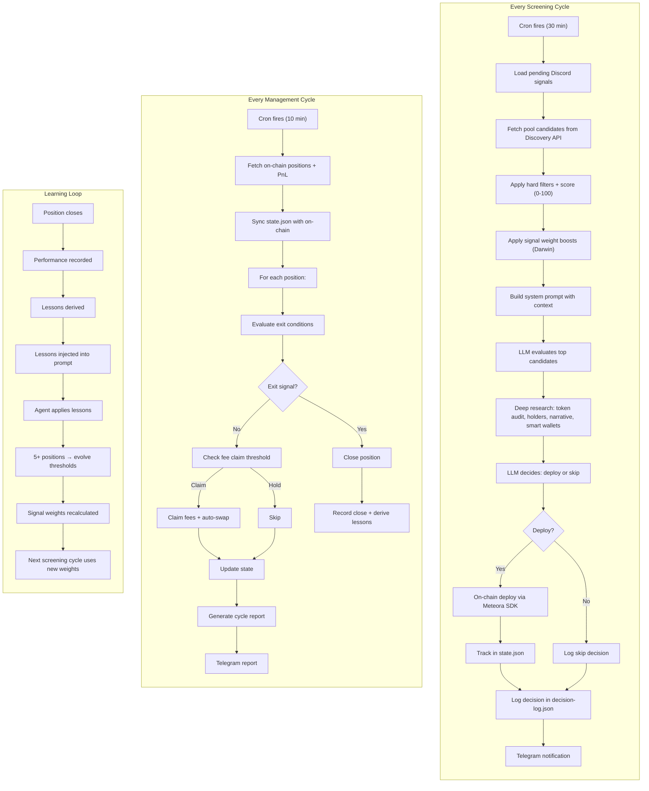
