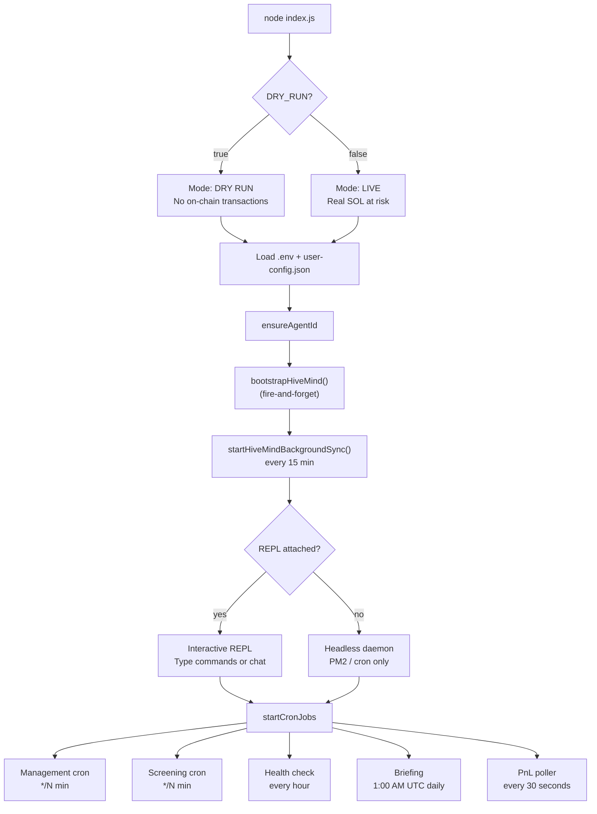
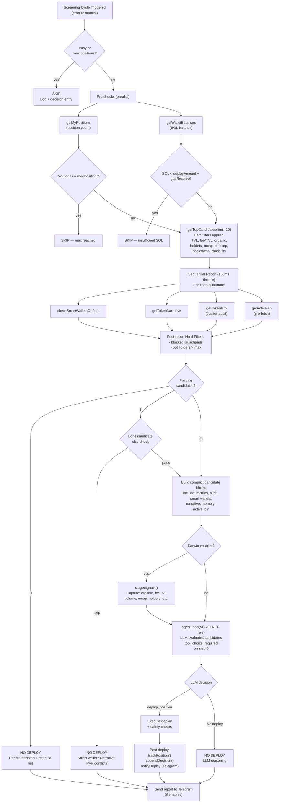
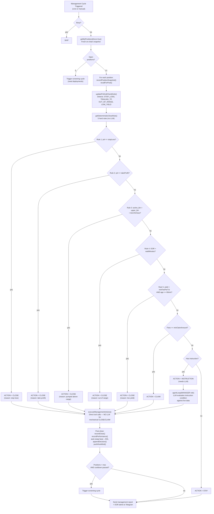
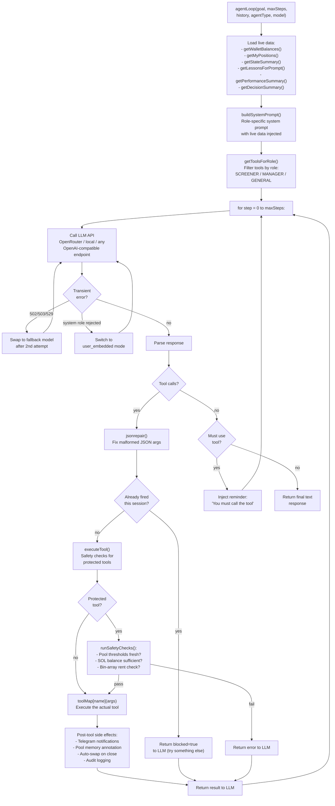
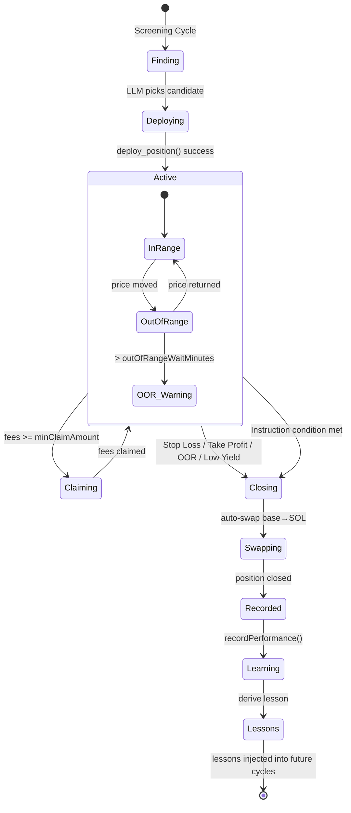
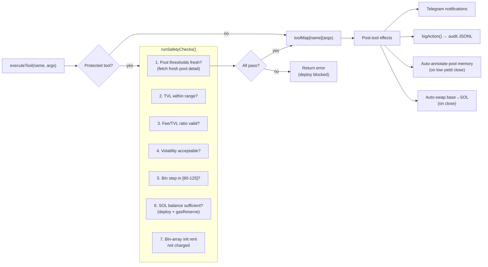

# Meridian — Flow Diagrams & Usage Guide

> This document shows **how data flows through the system** from startup to position close,
> and **how to use the application** at each stage. For config reference and architecture details,
> see [README.md](../README.md), [ARCHITECTURE.md](ARCHITECTURE.md), and [CONFIGURATION.md](CONFIGURATION.md).

---

## Table of Contents

1. [Application Startup](#1-application-startup)
2. [Screening Cycle Flow](#2-screening-cycle-flow)
3. [Management Cycle Flow](#3-management-cycle-flow)
4. [Agent Loop (ReAct)](#4-agent-loop-react)
5. [Position Lifecycle](#5-position-lifecycle)
6. [Tool Execution & Safety](#6-tool-execution--safety)
7. [How to Use — Step by Step](#7-how-to-use--step-by-step)

---

## 1. Application Startup

What happens when you run `npm start` or `npm run dev`.



**How to use:**

```bash
npm run dev        # DRY_RUN=true — safe testing, no real transactions
npm start          # LIVE mode — real SOL deployed
npm run pm2:start  # Headless daemon for VPS (24/7)
```

The REPL prompt shows countdown timers to the next cycle:
```
[manage: 8m 12s | screen: 24m 3s]
>
```

---

## 2. Screening Cycle Flow

The most complex flow — finds pools, evaluates them, and optionally deploys capital.



**How to use:**

```bash
# One-shot screening from CLI
npm run screen -- --dry-run

# From Telegram
/screen

# From Claude Code
/screen
```

---

## 3. Management Cycle Flow

Evaluates every open position against deterministic rules. LLM only for edge cases.



**The 5 Deterministic Close Rules** (applied in order, no LLM needed):

| Rule | Condition | Action |
|------|-----------|--------|
| 1 | `pnl_pct <= stopLossPct` (-15%) | CLOSE — stop loss |
| 2 | `pnl_pct >= takeProfitPct` (5%) | CLOSE — take profit |
| 3 | `active_bin > upper_bin + binsToClose` | CLOSE — pumped above range |
| 4 | `OOR > outOfRangeWaitMinutes` (30m) | CLOSE — out of range too long |
| 5 | `fee_per_tvl_24h < minFeePerTvl24h` AND `age >= 60min` | CLOSE — low yield |

**How to use:**

```bash
# One-shot management from CLI
npm run manage -- --dry-run

# From Telegram
/positions     # see all open positions
/close 1       # close position by list index

# From Claude Code
/manage
```

---

## 4. Agent Loop (ReAct)

The core ReAct loop that powers every LLM-driven cycle.



**Role-based tool access:**

| Role | Available Tools | When Used |
|------|----------------|-----------|
| `SCREENER` | deploy_position, get_top_candidates, get_active_bin, check_smart_wallets_on_pool, get_token_holders, get_token_narrative, get_token_info, search_pools, get_pool_memory, get_wallet_balance, get_my_positions | Every 30 min (cron) |
| `MANAGER` | close_position, claim_fees, swap_token, get_position_pnl, get_my_positions, get_wallet_balance | Every 10 min (cron) |
| `GENERAL` | Intent-matched subset (17 intents) | REPL, Telegram, Claude Code |

---

## 5. Position Lifecycle

The complete journey of a deployed position from creation to close.



**Position data flow:**

```
Deploy ──────► trackPosition() ──────► state.json
                                          │
Manage cycle ◄── getMyPositions() ◄───────┤
     │                                     │
     ├── updatePnlAndCheckExits() ◄────────┘
     ├── recordPositionSnapshot() ──► pool-memory.json
     └── close ──► recordClose() ──► state.json
                   │
                   ├── recordPerformance() ──► lessons.json
                   ├── auto-swap ──► Jupiter
                   ├── appendDecision() ──► decision-log.json
                   └── pushHiveMind() ──► Agent Meridian API
```

---

## 6. Tool Execution & Safety

Every tool call goes through `executeTool()` which adds safety layers for protected operations.



**Protected tools** (require safety checks):
- `deploy_position`
- `close_position`
- `claim_fees`
- `swap_token`
- `self_update`

**Once-per-session locks** (prevent duplicate actions):
- `deploy_position` — locked on first attempt (even if failed)
- `swap_token` — locked on success only
- `close_position` — locked on success only

---

## 7. How to Use — Step by Step

### First-time Setup

```bash
# 1. Clone and install
git clone https://github.com/yunus-0x/meridian
cd meridian
npm install

# 2. Run the interactive wizard (creates .env + user-config.json)
npm run setup
# You'll choose a preset (degen/moderate/safe) and enter:
#   - Solana wallet private key
#   - RPC URL (Helius recommended)
#   - OpenRouter API key
#   - Telegram bot token (optional)
#   - Strategy preferences

# 3. Test in dry-run mode
npm run dev
# This starts the REPL + cron but skips all on-chain transactions
```

### Day-to-Day Operations

**Autonomous mode** (hands-off):
```bash
npm start          # Live mode with REPL
npm run pm2:start  # Headless daemon for VPS
```

**One-shot CLI** (scripting / debugging):
```bash
npm run balance                              # Check wallet
npm run positions                            # Open positions
npm run candidates -- --limit 5              # Top pool candidates
npm run cli pnl -- <position_address>        # PnL for a position
npm run screen -- --dry-run                  # Run one screening cycle
npm run manage -- --dry-run                  # Run one management cycle
npm run cli deploy -- --pool <addr> --amount 0.5 --dry-run
npm run cli close -- --position <addr> --dry-run
npm run cli swap -- --from <mint> --to SOL --amount 100 --dry-run
npm run lessons                              # View learned lessons
npm run evolve                               # Auto-adjust thresholds
```

**Telegram commands** (remote control):
```
/status          — wallet balance + open positions
/positions       — detailed position list with PnL
/close <n>       — close position by index
/set <n> <text>  — set instruction on a position
/screen          — trigger screening cycle
/candidates      — show top candidates
/briefing        — generate daily report
/pause           — pause cron jobs
/resume          — resume cron jobs
```

**Claude Code** (AI-powered terminal):
```bash
claude              # Start Claude Code in repo dir
/screen             # Full AI screening cycle
/manage             # Full AI management cycle
/balance            # Wallet check
/positions          # Position list
/candidates         # Enriched candidate research
```

### The Decision Flow — When Does Meridian Deploy?

```
Cron fires screening cycle
        │
        ├── Enough positions open? → SKIP
        ├── Enough SOL? → SKIP
        ├── Find top candidates via Meteora API
        │     ├── Filter by: TVL, fee/TVL, organic score,
        │     │   holders, mcap, bin step, cooldowns, blacklists
        │     └── Enrich each: smart wallets, narrative, token audit
        ├── Post-recon filters: launchpad, bot holders
        ├── Zero candidates? → NO DEPLOY
        ├── One candidate? → skip if weak (no smart wallet, no narrative)
        └── LLM evaluates → picks best or says NO DEPLOY
              └── deploy_position() → trackPosition() → Telegram notify
```

### The Decision Flow — When Does Meridian Close?

```
Cron fires management cycle
        │
        ├── Fetch all positions fresh from chain
        ├── For each position, check in order:
        │     1. Stop loss (pnl <= -15%)? → CLOSE
        │     2. Take profit (pnl >= 5%)? → CLOSE
        │     3. Pumped above range? → CLOSE
        │     4. OOR > 30 minutes? → CLOSE
        │     5. Low yield (< 0.55% fee/TVL 24h)? → CLOSE
        │     6. Has instruction? → LLM evaluates condition
        │     7. Fees >= min claim? → CLAIM
        │     8. None of above → STAY
        ├── Execute CLOSE/CLAIM directly (no LLM)
        ├── LLM only for INSTRUCTION positions
        └── After close: auto-swap base→SOL, record lesson
```

---

## Quick Reference — Entry Points

| What you want | How to do it |
|---|---|
| Safe testing | `npm run dev` (DRY_RUN) |
| Live trading | `npm start` or `npm run pm2:start` |
| One-shot screening | `npm run screen -- --dry-run` |
| One-shot management | `npm run manage -- --dry-run` |
| Check balance | `npm run balance` |
| List positions | `npm run positions` |
| Deploy manually | `npm run cli deploy -- --pool <addr> --amount 0.5 --dry-run` |
| Close manually | `npm run cli close -- --position <addr> --dry-run` |
| Remote control | Telegram `/positions`, `/close`, `/screen` |
| Learn from history | `npm run lessons` |
| Auto-evolve thresholds | `npm run evolve` |
